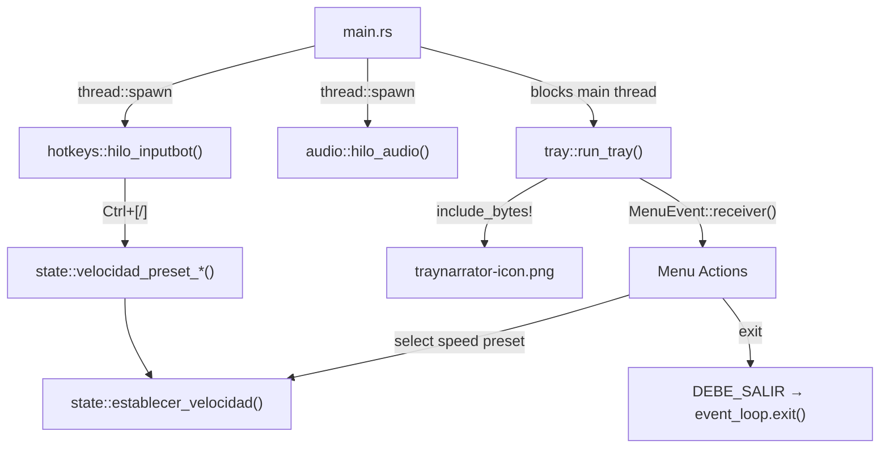

# Project Architecture

## Project Goal

TrayNarrator is an ultra-lightweight Windows desktop application that converts selected text to speech using [Piper TTS](https://github.com/rhasspy/piper). It runs in the background with global keyboard shortcuts and a system tray icon — no visible window.

## Tech Stack

### Core

| Technology | Version | Purpose |
|------------|---------|---------|
| Rust | 1.70+ (stable) | Systems language, single-binary output |
| Piper TTS | latest | External process for neural text-to-speech synthesis |

### Rust Crates

| Crate | Version | Purpose |
|-------|---------|---------|
| `inputbot` | 0.6 | Global keyboard hotkey bindings |
| `arboard` | 3.4 | Cross-platform clipboard read/write |
| `enigo` | 0.2 | Simulate keyboard input (Ctrl+C) |
| `rodio` | 0.19 | WAV audio playback via output stream + Sink |
| `lazy_static` | 1.5 | Thread-safe global static initialization |
| `parking_lot` | 0.12 | Efficient Mutex (lighter than std) |
| `tray-icon` | 0.19 | Cross-platform system tray icon |
| `muda` | 0.15 | Cross-platform context menu |
| `image` | 0.25 | PNG decoding for the tray icon |
| `winit` | 0.30 | Cross-platform window creation and event loop |

### Infrastructure

| Service | Purpose |
|---------|---------|
| GitHub Actions | CI (build + clippy on Ubuntu/WSL) and Release automation |
| GitHub Releases (`assets-v1`) | Hosts heavy Piper TTS binaries (~90 MB) separately from code |

## Directory Structure

```
TrayNarrator/
├── src/
│   ├── main.rs          # Entry point: spawns threads, launches tray event loop
│   ├── audio.rs         # Audio thread: rodio playback, mpsc command receiver
│   ├── clipboard.rs     # Clipboard access: copy simulation + read via arboard
│   ├── config.rs        # Compile-time constants (paths, speeds, VERSION)
│   ├── hotkeys.rs       # Global hotkey registration (F8, F9, Ctrl+[/] por presets xN)
│   ├── logging.rs       # Timestamped file-based logging
│   ├── state.rs         # Global state: atomics, enums, speed adjustment
│   ├── tray.rs          # System tray icon + context menu (tray-icon/muda/winit)
│   └── tts.rs           # Piper TTS subprocess invocation
├── assets/
│   └── traynarrator-icon.png   # System tray icon (embedded via include_bytes!)
├── piper/                   # Piper TTS runtime (gitignored, downloaded at release time)
│   ├── piper.exe
│   ├── es_ES-sharvard-medium.onnx       # Spanish voice model (~73 MB)
│   ├── es_ES-sharvard-medium.onnx.json  # Model config
│   ├── espeak-ng.dll / onnxruntime.dll / piper_phonemize.dll
│   └── espeak-ng-data/                  # Phoneme dictionaries
├── scripts/                 # Build, lint, deploy, and release helper scripts
│   ├── setup.sh             # Dev environment setup (hooks, targets)
│   ├── build.sh             # Cross-compile for Windows from WSL
│   ├── deploy-win.sh        # Copy program to C:\TrayNarrator
│   ├── build-and-deploy-wsl-win.sh
│   ├── lint.sh              # cargo fmt + clippy
│   ├── release.sh           # Package ZIP for manual releases
│   └── win/                 # Windows-native .bat equivalents
│       ├── build.bat
│       └── lint.bat
├── .github/
│   ├── workflows/
│   │   ├── ci.yml           # Format check, clippy, cross-compile build
│   │   └── release.yml      # Full release pipeline (download assets → build → ZIP → publish)
│   └── ISSUE_TEMPLATE/
├── release/                 # Local release artifacts (gitignored)
├── Cargo.toml               # Package metadata, deps, release profile, cargo-dist config
├── Cargo.lock
├── rust-toolchain.toml      # Pinned to stable, targets: windows-gnu + windows-msvc
├── AGENTS.md                # AI agent entry point
├── .context/                # AI context files (this directory)
├── CHANGELOG.md
├── CONTRIBUTING.md
├── README.md
└── LICENSE                  # MIT
```

## Data Flow



1. User selects text in any Windows application and presses **F8**
2. `inputbot` detects the hotkey → spawns a handler thread
3. `enigo` simulates **Ctrl+C** to copy the selection to the clipboard
4. `arboard` reads the clipboard text
5. Text is piped via stdin to **Piper TTS** (`piper.exe`), which writes a temp WAV file
6. A `ComandoAudio::Reproducir` message is sent over the **mpsc channel** to the audio thread
7. The audio thread opens the WAV with `rodio::Decoder` and plays it through a `Sink`
8. **F9** sends `TogglePausa`; **Ctrl+[/]** moves between contiguous `xN` presets and updates `VELOCIDAD_ACTUAL` (AtomicU32)

## Threading Model

| Thread | Responsibility |
|--------|---------------|
| **Main** | Runs the `winit` event loop for the system tray (`tray::run_tray()`) |
| **InputBot** | Listens for global hotkey events (`inputbot::handle_input_events()`) |
| **Audio** | Receives `ComandoAudio` commands, manages `rodio::Sink` playback |
| **Per-F8** | Short-lived: simulates Ctrl+C → reads clipboard → calls Piper → sends Reproducir |

## Global State

| Static | Type | Purpose |
|--------|------|---------|
| `ESTADO_AUDIO` | `AtomicU8` | Playback state: IDLE / REPRODUCIENDO / PAUSADO |
| `VELOCIDAD_ACTUAL` | `AtomicU32` | Speech speed (length_scale × 100) |
| `DEBE_SALIR` | `AtomicBool` | Application shutdown flag |
| `CANAL_AUDIO` | `Mutex<Option<Sender>>` | Channel sender for audio commands |

## Configuration

All configuration is done via **compile-time constants** in `src/config.rs`:

| Constant | Default | Description |
|----------|---------|-------------|
| `RUTA_PIPER` | `C:\TrayNarrator\piper\piper.exe` | Path to Piper executable |
| `RUTA_MODELO` | `C:\TrayNarrator\piper\es_ES-sharvard-medium.onnx` | Path to voice model |
| `RUTA_TEMP_WAV` | `C:\TrayNarrator\temp.wav` | Temporary WAV output path |
| `RUTA_LOG` | `C:\TrayNarrator\log.txt` | Log file path |
| `VELOCIDADES_PRESET` | `x0.5..x3` | Fixed speed presets `(label, length_scale × 100)` |
| `VELOCIDAD_PRESET_DEFECTO` | `2` | Default preset index (`x1`) |
| `VELOCIDAD_INICIAL` | `100` (= 1.0 length_scale = 1× speed) | Initial speech speed |
| `VERSION` | from `Cargo.toml` | Application version (via `env!("CARGO_PKG_VERSION")`) |

## Project Conventions

- **Branches**: `main`; feature branches via `feature/*`, `fix/*`
- **Commits**: Conventional Commits (enforced by pre-commit hooks)
- **Code Style**: `cargo fmt` + `cargo clippy` (run via git hooks and CI)
- **Language**: Code comments and identifiers are in **Spanish**
- **Details**: See `.context/rules/coding-standards.md`
