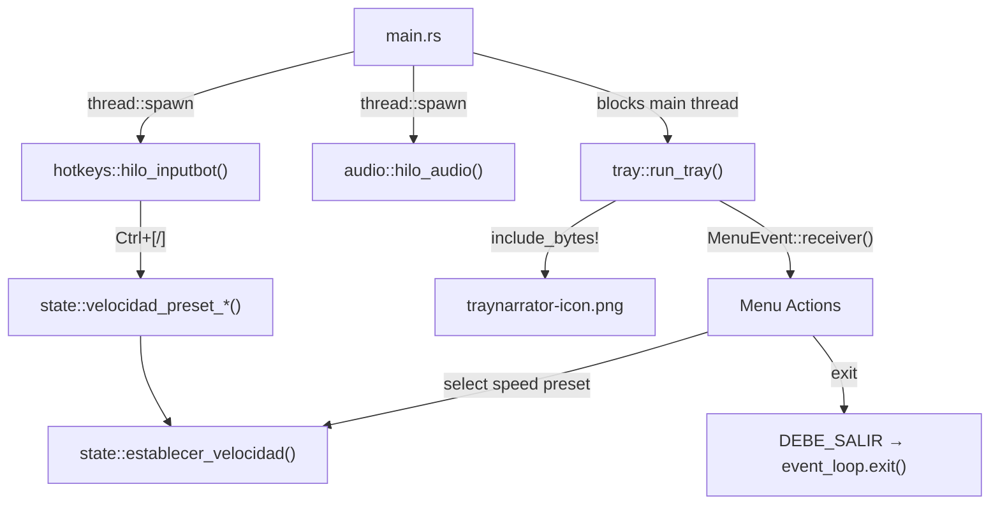

# TrayNarrator

<p align="center">
  <strong>Lector de texto a voz ultraligero para Windows</strong>
</p>

<p align="center">
  <a href="https://github.com/avicdro/TrayNarrator/releases"></a>
  <a href="https://github.com/avicdro/TrayNarrator/actions"></a>
  <a href="LICENSE"></a>
</p>

<p align="center">
  <a href="#características">Características</a> •
  <a href="#instalación">Instalación</a> •
  <a href="#uso">Uso</a> •
  <a href="#compilación">Compilación</a> •
  <a href="#licencia">Licencia</a>
</p>

---

TrayNarrator es una aplicación de escritorio minimalista que convierte texto seleccionado en voz usando [Piper TTS](https://github.com/rhasspy/piper). Funciona en segundo plano con atajos de teclado globales y un icono en la bandeja del sistema.

## Características

- **Ultraligero**: ~950KB de binario, bajo consumo de RAM
- **Simple**: Selecciona texto → F8 → Escucha
- **Control de velocidad**: Ajusta la velocidad de lectura en tiempo real
- **Pausa/Reanuda**: Control total de la reproducción
- **Invisible**: Sin ventana, control total desde el icono de la bandeja del sistema (Menú Contextual)
- **Rápido**: Piper TTS genera audio de alta calidad casi instantáneamente

## Atajos de Teclado

| Atajo | Acción |
|-------|--------|
| `F8` | Copiar texto seleccionado y leerlo |
| `F9` | Pausar / Reanudar reproducción |
| `Ctrl+[` | Más rápido (siguiente preset xN) |
| `Ctrl+]` | Más lento (preset anterior xN) |

## Presets de Velocidad (xN)

La velocidad se controla por presets fijos para mantener una experiencia consistente entre hotkeys y menú del tray:

- `x0.5`
- `x0.75`
- `x1` (valor por defecto)
- `x1.25`
- `x1.5`
- `x2`
- `x3`

Notas:
- `Ctrl+[` avanza al siguiente preset (más rápido).
- `Ctrl+]` vuelve al preset anterior (más lento).
- Ejemplo: si estás en `x1` y presionas más lento, pasa a `x0.75`.
- El menú del tray se sincroniza automáticamente cuando cambias velocidad con hotkeys.

## Requisitos

- Windows 10/11 (64-bit)
- [Piper TTS](https://github.com/rhasspy/piper/releases) (incluido en releases)
- Modelo de voz `.onnx` (se incluye modelo en español)

## Instalación

### Opción 1: Descargar Release (Recomendado)

1. Descarga la última versión desde [Releases](../../releases)
2. Extrae el contenido en `C:\TrayNarrator\`
3. Ejecuta `tray_narrator.exe`

### Opción 2: Instalación Manual

1. Crea la carpeta `C:\TrayNarrator\piper\`

2. Descarga y copia los archivos de Piper:
   - `piper.exe` desde [Piper Releases](https://github.com/rhasspy/piper/releases)
   - Carpeta `espeak-ng-data/`
   - DLLs necesarias (`onnxruntime.dll`, `espeak-ng.dll`, `piper_phonemize.dll`)

3. Descarga un modelo de voz:
   - [Modelos en español](https://huggingface.co/rhasspy/piper-voices/tree/main/es/es_ES)
   - Recomendado: `es_ES-sharvard-medium.onnx` + `.json`

4. Copia `tray_narrator.exe` a `C:\TrayNarrator\`

### Estructura de archivos

```
C:\TrayNarrator\
├── tray_narrator.exe
├── log.txt (se crea automáticamente)
└── piper\
    ├── piper.exe
    ├── es_ES-sharvard-medium.onnx
    ├── es_ES-sharvard-medium.onnx.json
    ├── espeak-ng.dll
    ├── onnxruntime.dll
    ├── piper_phonemize.dll
    └── espeak-ng-data\
        └── ... (diccionarios de idiomas)
```

### Inicio Automático (Opcional)

1. Presiona `Win+R`, escribe `shell:startup`
2. Crea un acceso directo a `tray_narrator.exe` en esa carpeta

## Uso

1. **Inicia la aplicación**: Ejecuta `tray_narrator.exe`
   - Aparecerá un icono en la bandeja del sistema
   - No hay ventana visible

2. **Lee texto**: 
   - Selecciona cualquier texto en cualquier aplicación
   - Presiona `F8`
   - El texto será leído en voz alta

3. **Controla la reproducción**:
   - `F9` para pausar/reanudar
   - `F8` de nuevo para detener y leer otro texto

4. **Ajusta la velocidad**:
   - `Ctrl+[` para pasar al siguiente preset más rápido
   - `Ctrl+]` para volver al preset más lento
   - El cambio aplica a la próxima lectura
   - El submenú de velocidad del tray refleja el cambio automáticamente

5. **Cerrar la aplicación**:
   - Click derecho en el icono de la bandeja → "Salir"

## Configuración

Edita las constantes en `src/config.rs` antes de compilar:

```rust
/// Ruta al ejecutable de Piper TTS
pub const RUTA_PIPER: &str = r"C:\TrayNarrator\piper\piper.exe";

/// Ruta al modelo de voz .onnx
pub const RUTA_MODELO: &str = r"C:\TrayNarrator\piper\es_ES-sharvard-medium.onnx";

/// Presets de velocidad en formato xN (etiqueta, length_scale × 100)
pub const VELOCIDADES_PRESET: &[(&str, u32)] = &[
   ("x0.5", 200),
   ("x0.75", 133),
   ("x1", 100),
   ("x1.25", 80),
   ("x1.5", 67),
   ("x2", 50),
   ("x3", 33),
];

/// Preset por defecto: x1
pub const VELOCIDAD_PRESET_DEFECTO: usize = 2;
```

## Compilación

### Desde WSL2 (Linux)

```bash
# Instalar Rust
curl --proto '=https' --tlsv1.2 -sSf https://sh.rustup.rs | sh -s -- -y
source "$HOME/.cargo/env"

# Configurar cross-compilation para Windows
rustup target add x86_64-pc-windows-gnu
sudo apt-get install -y mingw-w64

# Clonar y compilar
git clone https://github.com/avicdro/TrayNarrator.git
cd TrayNarrator
cargo build --release --target x86_64-pc-windows-gnu

# El binario estará en:
# target/x86_64-pc-windows-gnu/release/tray_narrator.exe
```

### Desde Windows

```powershell
# Instalar Rust desde https://rustup.rs
# Luego:
git clone https://github.com/avicdro/TrayNarrator.git
cd TrayNarrator
cargo build --release

# El binario estará en:
# target/release/tray_narrator.exe
```

## Desarrollo

Para contribuir al proyecto, ejecuta el script de configuración:

```bash
./scripts/setup.sh
```

Esto configura:
- Git hooks para ejecutar `cargo fmt` y `cargo clippy` antes de cada commit
- Target de cross-compilation para Windows
- Componentes necesarios de Rust

### Scripts disponibles

| Script | Descripción |
|--------|-------------|
| `./scripts/setup.sh` | Configura el entorno de desarrollo |
| `./scripts/build.sh` | Compila el .exe para Windows (desde WSL) |
| `./scripts/deploy-win.sh` | Copia el programa completo a `C:\TrayNarrator` |
| `./scripts/build-and-deploy-wsl-win.sh` | Build + deploy en un solo paso |
| `./scripts/lint.sh` | Ejecuta cargo fmt y clippy |
| `./scripts/release.sh <version>` | Crea un zip para release |

**En Windows nativo:**
| Script | Descripción |
|--------|-------------|
| `scripts\win\build.bat` | Compila el .exe |
| `scripts\win\lint.bat` | Ejecuta fmt y clippy |

### Crear un Release

Las releases se crean automáticamente con GitHub Actions:

```bash
# 1. Actualiza la versión en Cargo.toml
# 2. Commit y push los cambios
git add .
git commit -m "release: v0.3.0"

# 3. Crea y sube el tag
git tag v0.3.0
git push && git push --tags
```

El workflow automáticamente:
1. Descarga los assets pesados desde `assets-v1`
2. Compila el binario para Windows x86_64
3. Crea el ZIP con todo incluido
4. Publica la release en GitHub

#### Actualizar Assets Pesados

Si necesitas actualizar Piper TTS o los modelos:

```bash
# Crear nuevo ZIP con la carpeta piper/
cd release
zip -r piper-assets.zip piper/

# Subir a la release assets-v1
gh release upload assets-v1 piper-assets.zip --clobber
```

#### Release Manual (Legacy)

También puedes crear releases manualmente:

```bash
./scripts/release.sh v1.0.0
```

## Arquitectura



### Dependencias

| Crate | Propósito |
|-------|-----------|
| `inputbot` | Atajos de teclado globales |
| `arboard` | Acceso al portapapeles |
| `enigo` | Simulación de teclado |
| `rodio` | Reproducción de audio |
| `parking_lot` | Mutex eficiente |
| `lazy_static` | Estado global |
| `tray-icon` | Icono de bandeja del sistema (cross-platform) |
| `muda` | Menú contextual (cross-platform) |
| `image` | Decodificación de PNG para el icono del tray |
| `winit` | Event loop para la interfaz gráfica |

## Troubleshooting

### No se escucha audio
- Verifica que las rutas en `src/config.rs` sean correctas
- Revisa `C:\TrayNarrator\log.txt` para ver errores
- Asegúrate de que `piper.exe` y el modelo `.onnx` existan

### Error al copiar texto
- Asegúrate de tener texto seleccionado antes de presionar F8
- Algunas aplicaciones pueden bloquear el acceso al portapapeles

### Piper no encontrado
- Verifica que `piper.exe` esté en `C:\TrayNarrator\piper\`
- Asegúrate de que todas las DLLs estén presentes

### El icono no aparece en la bandeja
- Puede estar oculto en los iconos secundarios
- Click en la flecha `^` de la bandeja del sistema

## Licencia

Este proyecto está bajo la [Licencia MIT](LICENSE).

## Créditos

- [Piper TTS](https://github.com/rhasspy/piper) - Motor de síntesis de voz
- [Piper Voices](https://huggingface.co/rhasspy/piper-voices) - Modelos de voz

